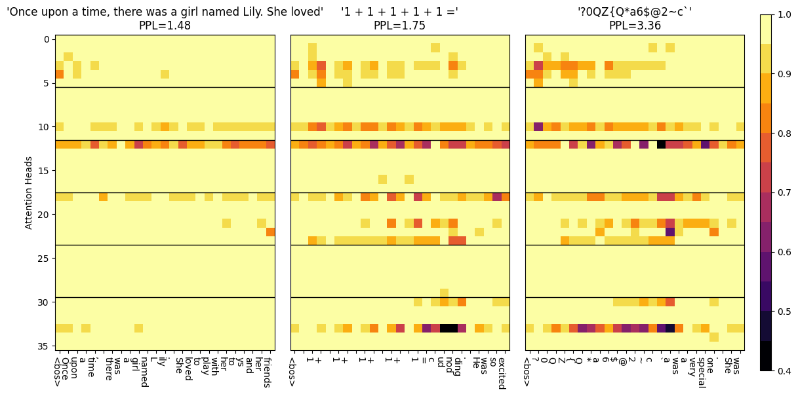
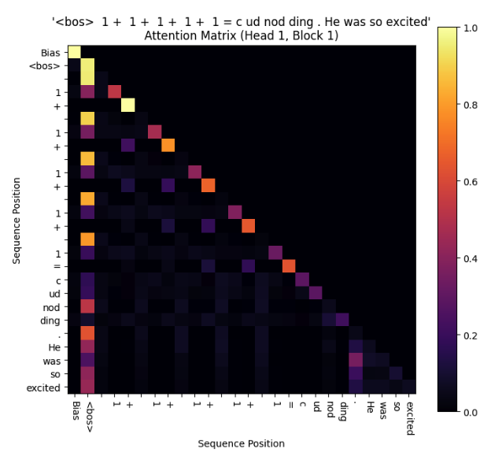
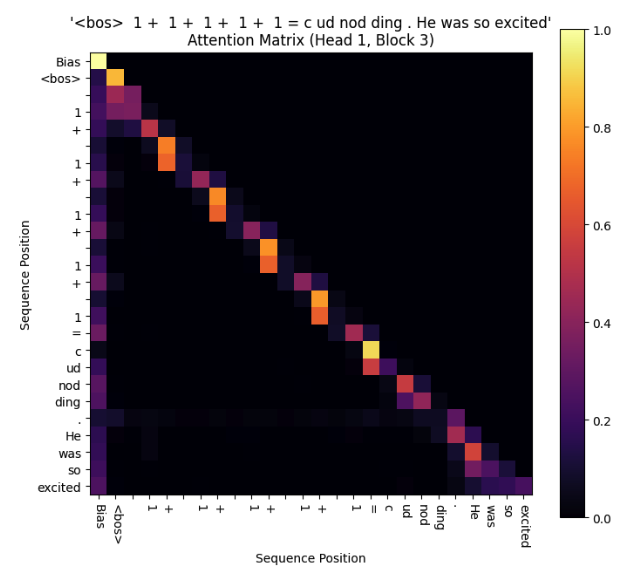

Have you seen the Twitter-viral blog post ["Attention is Off By One"](https://www.evanmiller.org/attention-is-off-by-one.html), preaching that softmax is broken?

## Softermax
Love it or hate it, Evan did propose a theory: after softmax, the sum of attention scores should vary between 0 and 1, instead of a standard fixed sum of 1. The original definition of softmax is: take a vector, and its output vector must sum to 1.

$$\text{softmax}(x)_i =\frac{e^{x_i}}{\sum_j e^{x_j}}, \quad \sum = 1$$

In the new **softer-max** function, you add a fixed bias term to the denominator, creating a *"fake token"*--it influences attention assignment, as it's in the denominator; but it's not in the numerator, so it doesn't multiply with the Value matrix (as in QKV self-attention), and doesn't contribute to later Transformer blocks.

$$\text{softermax}(x)_i =\frac{e^{x_i}}{\underset{bias}{e^0} + \sum_j e^{x_j}},\quad \sum \in (0,1) $$

So the bias is actually different from control tokens like \<BOS> (beginning of sequence), because the BOS token has a real entry in the softmax's numerator, gets multiplied with the V matrix, and does contribute itself to future Transformer blocks. The bias term does not.

Intuitively, if the model can learn a lower sum, perhaps an Attention Head could opt for this behaviour when it's less confident, and vote to contribute less of itself to subsequent blocks. Maybe *the attention sum is a self-check of the model's confidence?*

## Method
We put Evan's theory to the test with ablation: two models, identical in every way--parameter count (15M), token count (~500M), architecture (Llama2), dataset (TinyStories). Except for the softmax change: an original softmax (control), and our proposed softermax with the variable sum (treatment).

What we find? Obviously, the softmax's sums were fixed at one ... boring. But for soft*er*max's input prompts that were out-of-distribution or 'high perplexity' (think random hashes, gibberish), the [attention sums](https://github.com/softmax1/llama2.c-tinystories/blob/master/notebooks/attention_sums.ipynb) were lower, suggesting lower confidence. Conversely, 'low perplexity' inputs like simple English or in-distribution texts saw higher attention sums. 

<figure>
<figcaption>As perplexity rises, more attention heads show low sums (dark). This is just a qualitative illustration. </figcaption></figure>

So the attention sum does signal a model's confidence--lower sum, lower confidence? We notice not all parts of the model, or 'heads', showed this behavior. Some attention heads maintained high sums close to one, possibly focusing on functions like syntax or grammar, invariant to perplexity. So certain heads deliberately learn to use this inductive flexibility, while others don't need it.

## Attention Sinks
Shouldn't the bias be our [attention sink](https://github.com/softmax1/llama2.c-tinystories/blob/master/notebooks/attention_matrices.ipynb)--the black hole from which no attention escapes, if any head faces a high-perplexity token and is insecure?

Here comes the twist. When we look at the entire attention matrix, not just the sums, things get weird. Despite the new bias, there was already a dominant attention sink, the 'BOS' (beginning of string) token. This token always got strong attention irrespective of perplexity, whereas our bias sink is only apparent at high-perplexity inputs.

<figure>

<figurecaption>Every sequence has some head with BOS sinks; the 1st head of block 1 actually has a high attention sum (not shown), but most attention is spent on BOS (shown). In contrast, only high-perplexity sequences show a weak bias sink (on 1st head of block 3). </figurecaption>
</figure>

Why are there two attention sinks? If our bias sink really were 'better', why didn't the model combine them? Turns out, we can ditch the BOS token, which isn't used anymore as it wastes tokens. Instead of `<start>doc1<end><start>doc2<end>`, we'll retrain on the sequence pattern `doc1<sep>doc2`, and see what happens to the bias sink.

![[nerd_sniping.png]]

We open-source our [code](https://github.com/softmax1/llama2.c-tinystories) and [models](https://huggingface.co/photonmz/softmax1-tinystories), although they're not cleaned for public use, so please DM us on [Twitter](https://twitter.com/photon_mz) if you're serious about running them!